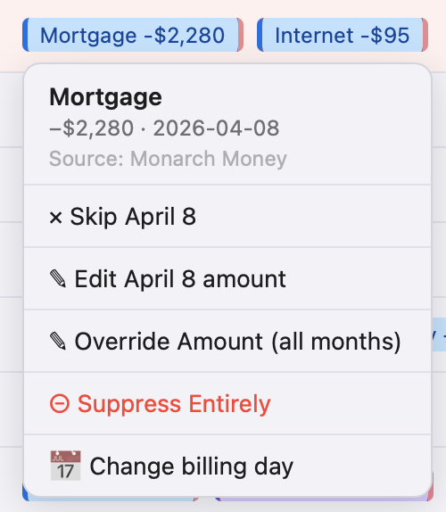
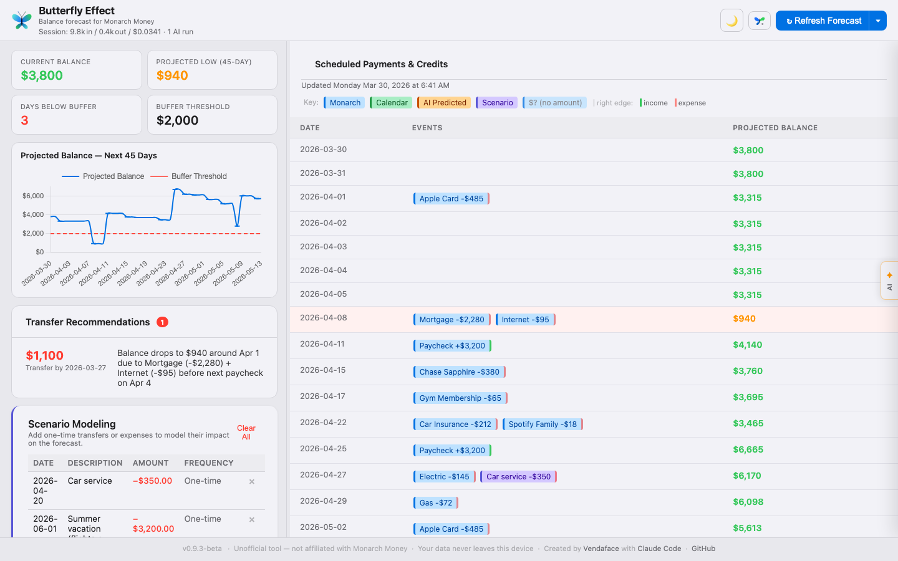
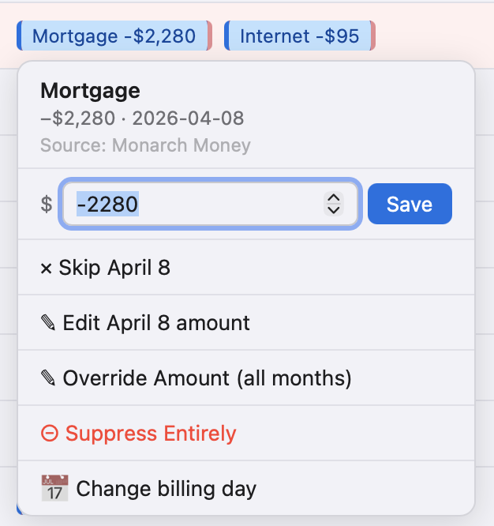
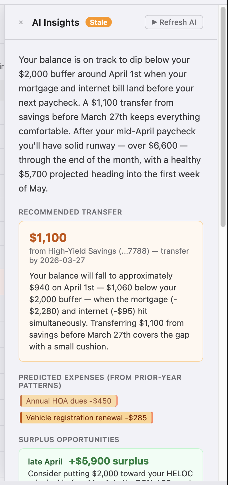
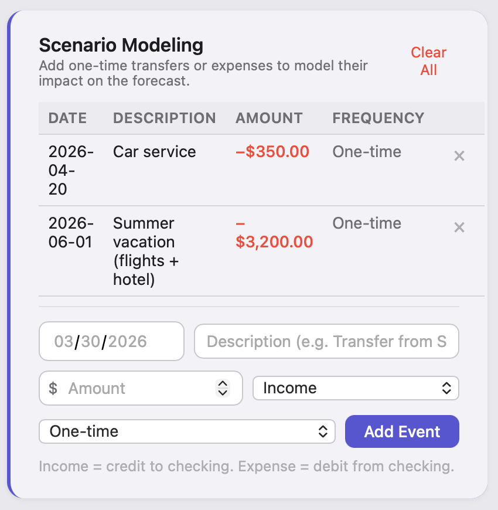
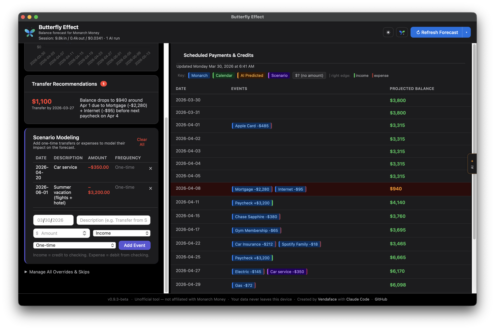
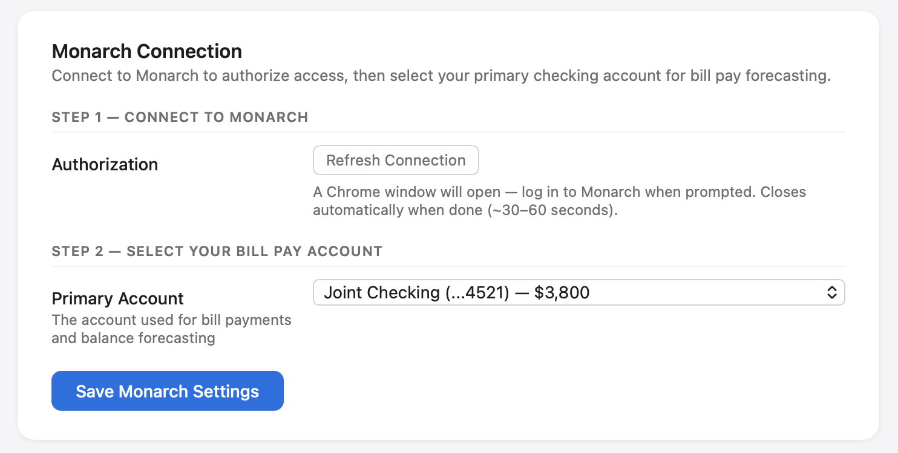
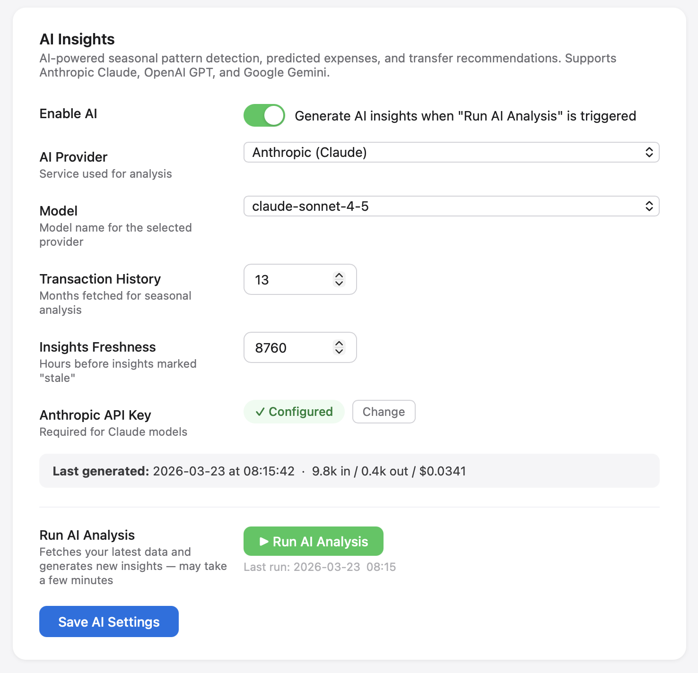

# Butterfly Effect v0.9.3-beta

> **Unofficial tool — not affiliated with or endorsed by Monarch Money, Inc. Use at your own risk.**

A self-hosted personal finance dashboard that pulls your **Monarch Money** account data and builds a rolling balance forecast. Everything runs on your own computer. No data ever leaves your device except the direct connection to Monarch's own servers and, optionally, your chosen AI provider.

---

## What this tool does

Butterfly Effect reads your transaction history and recurring payment schedule from Monarch Money and projects your checking account balance forward in time — by default 45 days, configurable to any horizon you like. It highlights upcoming low-balance windows, lets you model one-off transfers or expenses, and can optionally generate AI-powered narrative insights about spending patterns and upcoming bills.

Key capabilities:

- **Forecast chart** — rolling balance projection based on your Monarch recurring schedule
- **Variable Payments** — override the learned amount for credit cards or irregular bills
- **Billing Day Overrides** — correct the day-of-month a recurring payment is expected
- **Scenario Modeling** — add hypothetical transfers or expenses to see their impact
- **AI Insights** (optional) — seasonal patterns, predicted expenses, transfer recommendations
- **Calendar Integration** (optional) — overlay external Calendar events on the forecast chart
- **Dark mode**

---

## Screenshots

### Balance forecast — two-column layout

The main dashboard uses a fixed two-column layout. The left pane always shows your balance graph, stat cards, and transfer recommendations. The right pane scrolls independently through your upcoming transaction schedule.


---

### Resizable columns

Drag the handle between the two panes to resize them. The left column stays within a minimum and maximum width to keep both panes usable.

---

### Inspecting the balance forecast graph

Hover over any date on the balance graph to see that day's transactions.



---

### Transaction schedule

The right pane shows a scrollable agenda of upcoming dates with clickable transactions showing merchants and amounts. The last-refreshed timestamp appears in this pane's header.



---

### Editing a transaction inline

Click any transaction pill to open the editing panel. Change single amounts, change recurring amounts, suppress the series, or skip a single occurrence. The forecast updates instantly when you save.



---

### AI Insights drawer

Click the **AI** tab on the right edge of the window to slide the panel in from the right. It overlays the transaction schedule without shifting the graph. Transfer recommendations and seasonal spending observations appear here. The Corrections panel below lets you feed the AI specific facts about your finances to fix its accuracy.



---

### Scenario modeling

Add one-off transfers or expenses to model their impact on the forecast without modifying your real data.



---

### Dark mode

Switch between light and dark mode from Settings or the moon icon in the header.



---

### Settings — first run

On first launch the app opens directly to the Settings page, with the Monarch Connection section highlighted.


---

### Settings — Monarch Connection

Connect to Monarch via a temporary Chrome window. Your credentials go directly to Monarch — they are never seen or stored by this app.




---

### Settings — AI Insights

Configure your AI provider, model, and API key here. The **Last generated** line shows the timestamp, token counts, and cost of the most recent analysis. You can kick off a new analysis directly from this page and watch the live progress log.



---

## Disclaimer & legal notice

**This is an unofficial, community-built tool. It is not affiliated with, endorsed by, sponsored by, or in any way connected to Monarch Money, Inc.**

This tool automates a real Chromium browser session using your own Monarch credentials via [Playwright](https://playwright.dev/). It intercepts the same GraphQL network calls that the Monarch web application makes — it makes no additional or undocumented API requests beyond what your browser would make normally.

**This may violate Monarch's Terms of Service.** Use it for personal use only, at your own discretion, and at your own risk. The author makes no guarantees about continued compatibility. If Monarch updates their web app, this tool may stop working without notice.

**Support for this tool comes from the individual who created it, not from Monarch Money.** Do not contact Monarch Money's support team with questions about this tool.

---

## What you'll need before starting

- A **Mac** (macOS) or **Linux** computer — Windows not supported in this version
- A **[Monarch Money](https://www.monarchmoney.com/)** account
- **Python 3.11 or later** installed on your computer
  - Mac: download from [python.org](https://www.python.org/downloads/) or install via [Homebrew](https://brew.sh): `brew install python@3.12`
  - Linux: `sudo apt install python3` (Debian/Ubuntu) or `sudo dnf install python3` (Fedora)

**Optional — for AI insights:**
An API key from one of these providers (pick one). See [Setting up AI Insights](#setting-up-ai-insights) below for step-by-step instructions.
- [Anthropic (Claude)](https://console.anthropic.com/) — recommended
- [OpenAI (GPT)](https://platform.openai.com/)
- [Google (Gemini)](https://aistudio.google.com/)

---

## Getting started

### Step 1 — Download the app

Click the **Code** button on this page and choose **Download ZIP**. Unzip it somewhere you'll remember, like your Documents folder. (Or if you're already fluent in git just fork the repo and have at it.)

### Step 2 — Launch it

**On Mac:**
Double-click **`Start Balance Forecast.command`** in the folder. A startup page opens in your browser while the app initializes. On first run it will take a couple of minutes to set up — watch the terminal window for any dependency errors.

> The first time you open it, macOS may warn you it's from an unidentified developer. Right-click the file → **Open** → **Open** to proceed. You only need to do this once.

**On Linux:**
Right-click **`run.sh`** in your file manager → **Run as Program** (the exact wording depends on your desktop). Or open a Terminal, navigate to the folder, and enter `./run.sh`.

The launcher automatically:
- Detects Python and shows a friendly error page if it's missing or too old
- Sets up a Python virtual environment
- Installs all required packages
- Opens a startup page in your browser, then redirects to the app once it's ready

### Step 3 — Connect to Monarch

On first launch your browser opens directly to the **Settings** page. The **Monarch Connection** section (highlighted with a blue border) is the only required step:

1. Click **Connect to Monarch** — a Chrome browser window will open automatically. Log in to Monarch when prompted; the window closes on its own after a successful login (~30–60 seconds).
2. Wait for your eligible Monarch accounts to populate, then select your **primary bill pay account** from the dropdown that appears. Click **Save Monarch Settings** to complete the setup.

Once these two steps are complete, the **Go to Dashboard →** button at the top of the page will turn green. Click it to pull transactions and open your forecast — this may take 30 seconds or so on first run.

> Down further on the Settings page are **AI Insights** and **Forecast Settings**. These are both optional on first run and can always be customized later.

### Step 4 — View & customize your first forecast

The first time you open the dashboard the app fetches your transaction history from Monarch. Your forecast chart will appear at the top of the left pane when it's done. After the first run, your data stays cached so the dashboard loads instantly on future visits.

---

## Day-to-day use

**Starting the app:** Double-click **`Start Balance Forecast.command`** (Mac) or run `./run.sh` (Linux). A startup page opens in your browser and redirects automatically once the server is ready. You can also bookmark `http://localhost:5002`.

**Refresh Forecast** — click the button in the upper right whenever you want updated transaction data from Monarch. Takes 1–2 minutes.

**Run AI Analysis** — generates fresh AI insights. Run this once a day or whenever you want an updated analysis. Requires an AI API key in Settings → AI Insights.

**AI Insights drawer** — click the **AI** tab on the right edge of the window to slide the panel in over the transaction schedule. Click the **×** inside, or click the tab again, to close it.

**Resize columns** — drag the vertical handle between the two panes to adjust how much width each side gets.

**Settings** — click the butterfly icon (⚙) in the top-right to open Settings. Key options:

| Setting | Description |
|---|---|
| Primary Account | Select the account used for bill payments — refresh the list if you don't see it |
| AI Insights | Enable AI Insights (off by default); set your preferred provider (Anthropic, OpenAI, or Google), choose your preferred model and add your API key; set the default number of transaction months to retrieve for analysis; customize how long before the analysis is labeled as stale. You can also kick off an AI Analysis right from Settings and see it run in a status window |
| Forecast Horizon | How many days to project forward (default: 45) |
| Buffer Threshold | Get a warning when your balance drops below this dollar amount |
| User Context & AI Corrections | Hand-edit your AI corrections in free text (also stored in `user_context.md`) |
| Calendar Integration | Overlay custom calendar transaction events onto the forecast chart with Google Calendar, iCloud, or a custom ICS feed |
| App Settings | Change the default port, turn on debug mode, or reset to factory defaults |

---

## Setting up AI Insights

AI Insights is optional but adds meaningful value — seasonal spending patterns, predicted upcoming expenses, and transfer recommendations tailored to your actual history. You need an API key from one provider. The feature is off by default; you enable it in **Settings → AI Insights**.

### Choosing a provider

All three providers work. Anthropic's Claude is recommended because the prompt is tuned and tested against it, but OpenAI and Google Gemini produce good results too.

**Cost:** AI analysis runs once on demand (you click "Run AI Analysis"). A single analysis call uses roughly 3,000–8,000 tokens depending on how many months of history you include. At current pricing this is fractions of a cent per run — typically under $0.05. None of the providers charge for having an account or holding an API key; you only pay for what you use.

---

### Anthropic (Claude) — recommended

1. Go to [console.anthropic.com](https://console.anthropic.com/) and sign up or sign in.
2. In the left sidebar click **API Keys**.
3. Click **Create Key**, give it a name (e.g. "Butterfly Effect"), and click **Create Key**.
4. Copy the key — it starts with `sk-ant-api03-…`. **You won't be able to see it again after closing this dialog**, so copy it now.
5. In the app go to **Settings → AI Insights**, set the provider to **Anthropic**, and paste the key into the API Key field. Click **Save AI Settings**.

New Anthropic accounts receive a small free credit to start. After that, usage is billed at [published rates](https://www.anthropic.com/pricing).

---

### OpenAI (GPT)

1. Go to [platform.openai.com](https://platform.openai.com/) and sign up or sign in.
2. Click your profile icon in the top-right corner and choose **Your profile**, then select **API keys** in the left sidebar — or go directly to [platform.openai.com/api-keys](https://platform.openai.com/api-keys).
3. Click **Create new secret key**, give it a name, and click **Create secret key**.
4. Copy the key — it starts with `sk-proj-…` or `sk-…`. **Store it somewhere safe; it won't be shown again.**
5. In the app go to **Settings → AI Insights**, set the provider to **OpenAI**, and paste the key into the API Key field. Click **Save AI Settings**.

OpenAI requires a paid account (add a credit card under **Billing → Payment methods**) before API keys will work. Usage is billed at [published rates](https://openai.com/api/pricing).

---

### Google (Gemini)

1. Go to [aistudio.google.com](https://aistudio.google.com/) and sign in with a Google account.
2. Click **Get API key** in the left sidebar, then **Create API key**.
3. Copy the key — it starts with `AIza…`.
4. In the app go to **Settings → AI Insights**, set the provider to **Google**, and paste the key into the API Key field. Click **Save AI Settings**.

Google AI Studio keys include a generous free tier. Usage beyond the free tier is billed at [published rates](https://ai.google.dev/pricing).

---

## Features

- **Two-column fixed-viewport layout** — graph, stat cards, and transfer recommendations always visible on the left; transaction schedule scrolls independently on the right
- **Resizable columns** — drag the handle between panes to fit your screen
- **AI Insights drawer** — slides in over the schedule on demand; doesn't disturb the layout when closed
- **Forecast balance chart** with recurring payments projected forward, configurable to any number of days
- **AI insights** (optional) — seasonal spending patterns, predicted upcoming expenses, transfer recommendations to maintain a balance above your configured buffer amount
- **Variable Payments** — override Monarch's learned amount for variable monthly payments like credit cards; enter $0 to suppress a payment from the forecast entirely for a month
- **Billing Day Overrides** — correct the day-of-month for any recurring payment whose billing date Monarch has learned incorrectly
- **Scenario Modeling** — temporarily model one-time transfers or expenses to see how they affect your balance forecast
- **Corrections & Context** — feed the AI specific facts about your finances to improve its accuracy
- **Startup page** — animated loading screen with helpful error messages if Python is missing or dependencies fail to install
- **Dark mode** — toggle in Settings or with the moon icon in the header

---

## Troubleshooting

**"Setup needed" error on the dashboard** — click **→ Open Settings** in the error box and complete the Monarch Connection section (connect to Monarch and select your primary account).

**Startup page shows a Python error** — follow the on-screen instructions to install Python 3.11 or later. On Mac, the page includes a Homebrew one-liner you can copy directly into Terminal.

**Forecast is slow** — this is normal on first run. The app opens a browser, logs into Monarch, and fetches months of transaction history. Subsequent loads use a cached session and are much faster.

**Monarch login fails** — a Chrome window opens for you to log in. Complete any two-factor authentication steps there; the window closes automatically once you're logged in.

**Account list looks incomplete after connecting** — click **Refresh Accounts** in Settings → Monarch Connection.

**"API key is not configured"** — go to Settings → AI Insights, select your AI provider, and paste in your key. See [Setting up AI Insights](#setting-up-ai-insights) for step-by-step instructions on getting a key from each provider.

**Browser doesn't open automatically (Linux)** — navigate to `http://localhost:5002` in your browser manually.

**The app was working and suddenly stopped** — Monarch occasionally updates their web app, which can break the data-fetching layer. Check the [project page on GitHub](https://github.com/vendaface/butterfly-effect) for updates.

---

## Architecture & privacy

**All your data stays on your computer. Nothing is uploaded to any cloud service operated by this tool.**

Here is exactly where data flows and where it is stored:

### Authentication & Monarch connection

1. When you click **Connect to Monarch**, a Chromium browser window opens on your machine. You log in directly to `app.monarchmoney.com` — your credentials go from your keyboard to Monarch's servers, nowhere else.
2. After a successful login, Playwright saves your session cookies to `browser_state.json`. Subsequent data fetches use this saved session (headless, no visible window) to avoid repeated logins.
3. All future data fetches go directly from your computer to `api.monarch.com` — the same GraphQL endpoint your browser uses when you visit Monarch normally.

### Data storage (all files are local)

All runtime data is stored in your user data directory — never in a cloud service or the app bundle:

- **Mac:** `~/Library/Application Support/Butterfly Effect/`
- **Linux:** `~/.local/share/butterfly-effect/`

| File | What it contains | Leaves your device? |
|---|---|---|
| `.env` | AI API key | **Never** |
| `browser_state.json` | Monarch session cookies | **Never** |
| `config.yaml` | App preferences (account ID, forecast horizon, etc.) | **Never** |
| `insights.json` | AI analysis output | Only if you configure an AI provider |
| `payment_overrides.json` | Your variable payment amounts | **Never** |
| `payment_day_overrides.json` | Your billing day corrections | **Never** |
| `scenarios.json` | Scenario modeling events | **Never** |
| `monarch_accounts_cache.json` | Account names and IDs from Monarch | **Never** |
| `monarch_raw_cache.json` | Cached Monarch transaction data | **Never** |
| `user_context.md` | Corrections you feed to the AI | Only if you configure an AI provider |

All sensitive files are written with owner-only permissions (`chmod 600`) so other users on the same machine cannot read them.

### Security

The local web server uses CSRF tokens to protect all state-changing API calls. Every form submission and data-mutation request from the browser is validated against a per-session token that outside pages cannot read. Response headers (`X-Frame-Options`, `X-Content-Type-Options`, `Referrer-Policy`) are set on all API routes.

The app runs a local web server at `http://localhost:5002` by default. This server is only accessible from your own computer — it does not listen on a network interface accessible to other devices.

### AI provider data handling (optional feature)

If you enable AI Insights, the app sends a summary of your recent transactions and recurring payments to the AI provider you choose (Anthropic, OpenAI, or Google). **Before enabling this feature, review the privacy policy of your chosen provider:**

- [Anthropic Privacy Policy](https://www.anthropic.com/privacy)
- [OpenAI Privacy Policy](https://openai.com/policies/privacy-policy)
- [Google Privacy Policy](https://policies.google.com/privacy)

Your AI API key is stored only in `.env` on your device. It is sent only to your chosen provider's API endpoint to authenticate requests — it is never transmitted to any server operated by this tool or its author.

---

## Power user reference

### Running from Terminal

```bash
# Start (foreground — closes when you close the Terminal window)
./run.sh

# Start as a background daemon
./server.sh start

# Other daemon controls
./server.sh stop       # stop the server
./server.sh restart    # restart after config changes
./server.sh status     # check if running
./server.sh logs       # tail the server log
```

### File overview

All runtime files live in your user data directory:
- **Mac:** `~/Library/Application Support/Butterfly Effect/`
- **Linux:** `~/.local/share/butterfly-effect/`

| File | Purpose |
|---|---|
| `config.yaml` | Main configuration (auto-created on first launch) |
| `.env` | AI API key (auto-created when you save an AI key) |
| `browser_state.json` | Saved Monarch login session |
| `monarch_raw_cache.json` | Cached Monarch transaction data (enables instant startup) |
| `monarch_accounts_cache.json` | Cached account list from Monarch |
| `insights.json` | Latest AI analysis output |
| `payment_overrides.json` | Variable payment amounts you've set |
| `payment_day_overrides.json` | Billing day corrections |
| `scenarios.json` | Scenario modeling events |
| `dismissed_suggestions.json` | AI suggestions you've dismissed |
| `user_context.md` | Corrections and facts injected into AI prompts |

### Resetting to a clean state

```bash
./reset-for-testing.sh
```

Kills the running server, deletes all cached and generated files, and removes the virtual environment. You will be asked to confirm before anything is deleted.

---

## Known limitations

- No official Monarch API exists — this tool intercepts the same network calls the Monarch web app makes. Changes to Monarch's web app may break it without warning.
- Designed for desktop use; mobile layout is not optimized.
- Windows is not supported in this version.

---

## License

MIT — see `LICENSE` file.

This software is provided "as is", without warranty of any kind. The author is not responsible for any account issues, data loss, or Terms of Service consequences that may arise from its use.
